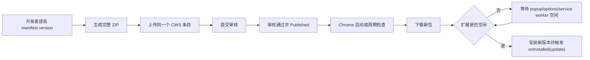
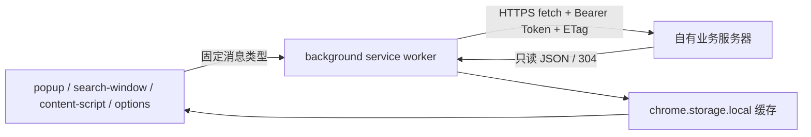

# Chrome Bookmarks Search 自动更新与自有服务器接入调研及 PRD

**文档版本**：v1.0  
**创建日期**：2026-07-17  
**状态**：方案评审  
**适用版本**：当前基线 v1.10.1，建议从 v1.10.2 起实施  
**关联项目**：Chrome Bookmarks Search（Manifest V3）

---

## 一、结论摘要

两个需求都可以实现，但需要区分三个完全不同的概念：

1. **扩展代码自动更新**：交给 Chrome Web Store（CWS）和 Chrome 自带更新机制。
2. **扩展读取业务服务器数据**：扩展通过 HTTPS API 从自有服务器读取 JSON 数据。
3. **自托管扩展安装包**：自己托管 CRX 和更新清单，仅适合企业受管环境或部分 Linux 场景，不适合普通 Windows/macOS 用户。

推荐方案是：**公开版本通过 Chrome Web Store 分发和自动更新，同时由 Manifest V3 background service worker 访问固定的自有 HTTPS API。** 两条链路独立，不需要为了读取服务器数据而自建扩展更新服务。当前仓库没有可核验的 CWS 条目 ID，因此实施前必须先确认“更新既有条目”还是“创建并首次发布新条目”。

### 1.1 可行性矩阵

| 需求 | 是否可实现 | 结论 |
| --- | --- | --- |
| 发布新版后，已安装用户自动更新 | 可以 | 如果用户从某个 CWS 条目安装，则在该同一条目提高 `manifest.version`、审核并正式发布后，由 Chrome 自动检查和安装 |
| 发布后立即强制所有用户更新 | 不可保证 | Chrome 通常在启动及每隔数小时检查，且要等扩展空闲后安装；开发者不能保证瞬时全量生效 |
| 用户收到“已更新”说明 | 可以 | 扩展通过 `runtime.onInstalled` 识别更新，在下次打开扩展时展示版本说明 |
| 用户收到系统级更新通知 | 可以但不推荐默认开启 | 需要 `notifications` 权限；建议仅作为用户主动开启的可选能力 |
| 扩展读取公网自有服务器 | 可以 | background service worker 使用 `fetch()`，并声明或动态申请对应 origin 的 host permission |
| 扩展读取局域网或 localhost | 有条件 | Chrome 142+ 的 Local Network Access 规则会影响本地网络请求，需单独做真机权限与兼容性验收；不纳入本期 MVP |
| 服务器下发 JavaScript/WASM 后执行 | 不可以 | Manifest V3 禁止远程托管可执行代码；服务器只能返回数据、内容或声明式配置 |
| 普通 Windows/macOS 用户从私人服务器自动安装 CRX | 不适合 | 官方自托管分发仅适用于企业策略；公众分发应走 CWS |

### 1.2 本文默认假设

由于“服务器的信息”尚未明确具体业务含义，本文先按最小可落地范围设计：

- 服务器是有有效证书的**公网 HTTPS 固定域名**。
- 服务器提供**只读 JSON 信息**，第一阶段在 Options 页展示连接状态、同步时间和信息列表。
- 扩展**不向服务器上传**书签、历史记录、下载记录、标签页、网页正文或 AI Key。
- 第一阶段不做双向同步、不做多人协作、不做实时推送。
- 单用户/小范围使用先采用可撤销、只读 scope 的 Personal Access Token（PAT）；公共多用户产品再升级 OAuth 2.0 Authorization Code + PKCE。

若实际目标是“云同步书签”“服务端搜索”“远程配置实验”或“托管 AI 代理”，需要在本方案的连接层之上再补对应业务 PRD，不能用一个模糊的 Server URL 同时承载所有职责。

---

## 二、仓库现状审计

### 2.1 当前已有基础

- 当前是 Manifest V3，版本为 `1.10.1`。
- 后台入口为 `background.js` service worker，已有统一 `chrome.runtime.onMessage` 消息处理链路。
- 已使用 `chrome.alarms`，可以复用为非实时的服务器定期刷新调度器。
- 智能搜索已经在 background 中通过 `fetch()` 调用 Gemini、OpenAI、Qwen、SiliconFlow 和自定义 OpenAI 兼容 API。
- 现有 `host_permissions` 为 `*://*/*`，技术上已经覆盖任意 HTTP/HTTPS 服务。
- 项目已有 `chrome.storage.local` 缓存模式和离线降级经验。

因此，“从服务器读取数据”的核心技术不是从零开始，主要缺口是**独立配置模型、明确 API 合同、鉴权、缓存、错误处理、安全边界和 UI**。

### 2.2 当前缺口与上线阻塞

| 项目 | 当前状态 | 影响 |
| --- | --- | --- |
| CWS 更新监听 | 没有 `onUpdateAvailable` / `requestUpdateCheck`；`onInstalled` 未区分 install/update | 无法展示更新说明或安全地处理待安装更新 |
| CWS 发布身份 | 仓库内没有可核验的 CWS 条目 ID、开发者账号所有权记录 | 不能假定当前已经具备可自动更新的同一商店条目 |
| 更新说明 | 没有随包发布的 release notes 数据 | 用户只能被静默更新，不知道变化 |
| 打包完整性 | `scripts/build.sh` 未包含 `ExtPay.js`、`offscreen.html`、`offscreen.js` | 当前 ZIP 可能在商店安装后启动失败，属于 P0 |
| 版本一致性 | manifest 为 1.10.1，`PUBLISH.md` 为 1.8.0，CHANGELOG 最高为 1.6.0；Options 还硬编码版本号 | 发版容易漏改或产生错误展示 |
| 权限范围 | `*://*/*` 远大于单一服务器所需；Google favicon 条目又被通配符覆盖 | CWS 最小权限审查和用户信任风险 |
| API Key 存储 | AI Key 当前写入 `chrome.storage.sync` | 不应复制到新服务器 Token 设计；扩展存储并不等同于安全密钥库 |
| Server 模型 | 没有独立服务器配置、Token、ETag、游标、缓存和错误码模型 | 无法形成稳定可维护的服务端集成 |
| Badge 冲突 | action badge 已被健康检查问题数、Pro 试用剩余天数使用 | 更新提醒不能直接再抢占 badge，需要统一优先级或不用 badge |

### 2.3 P0 前置修复

首次正式依赖自动更新前，必须先完成：

1. 确认是否已有 CWS 条目、条目 ID 和开发者账号所有权；已有则只能更新同一条目，没有则先创建并完成首次发布。
2. 修正打包清单，确保所有运行时依赖进入 ZIP。
3. 让打包流程在缺失运行时文件时直接失败。
4. 从 `manifest.json` 动态读取 UI 版本号，移除 Options 页硬编码。
5. 统一 `PUBLISH.md`、CHANGELOG 和 manifest 版本来源。
6. 对生成的 ZIP 解压后执行一次“加载已解压扩展”验收，确认 service worker 无启动错误。

---

## 三、自动更新机制调研

### 3.1 Chrome Web Store 标准更新链路



Chrome 官方说明：浏览器会在启动时及每隔数小时检查扩展更新。新包下载后，扩展要进入 idle 才会安装；MV3 service worker 正在运行、popup 或 Options 页持续打开都会延后安装。因此：

- “已发布”不等于“所有用户已经更新”。
- 不应向用户承诺分钟级全量更新 SLA。
- 用户可在 `chrome://extensions` 打开开发者模式并点击 **Update** 手动检查全部扩展。

### 3.2 开发者每次发版需要做什么

若尚无 CWS 条目，先完成首次发布：

1. 注册 Chrome Web Store 开发者账号并支付一次性注册费用。
2. 开启 Google 账号两步验证。
3. 创建唯一的 CWS 条目，填写 Store Listing、Privacy、Distribution 和必要的测试说明。
4. 上传完整 ZIP，提交审核并发布。
5. 后续所有版本都更新这个条目，保持扩展 ID 不变。

若已经存在 CWS 条目，则先核对条目 ID、开发者账号/发布者组所有权和当前线上版本，禁止另建重复条目承接更新。

每次更新：

1. 提高 `manifest.version`，例如 `1.10.1` → `1.10.2`。
2. 更新本地 release notes、隐私披露和商店元数据（如有变化）。
3. 检查 manifest permission diff；新增会触发警告的 required permission 可能让现有扩展暂停/禁用，直到用户接受新权限。
4. 运行打包校验并人工回归解压后的真实包。
5. 上传新包，Submit for Review。
6. 审核通过后自动发布，或使用 Deferred publishing 手工选择时间；审核通过后的 staged 包最多保留 30 天。
7. 观察按版本的活跃用户和错误反馈，必要时回滚。

可以后续使用 Chrome Web Store API v2 自动上传和发布，但 API 不会绕过版本递增和审核要求。

### 3.3 分批发布与回滚

- Percentage rollout 仅对**超过 10,000 七日活跃用户**的已发布条目开放。
- 分批发布期间可以提高百分比，不需要重新审核。
- 同时只能存在一个 partial rollout；发布更新版本会停止上一版本继续扩散。
- Web Store rollback 会把上一已发布包以更高版本号重新发布，服务端恢复较快，但用户端仍走正常更新周期。
- 为保证可回滚，storage 数据结构迁移必须尽量向后兼容，不能立刻删除旧版本仍需的数据。

### 3.4 用户更新通知的正确设计

#### 推荐：安装完成后在扩展内展示更新说明

在 `chrome.runtime.onInstalled` 中判断：

```javascript
chrome.runtime.onInstalled.addListener(async (details) => {
  if (details.reason !== 'update') return;

  await chrome.storage.local.set({
    updateNotice: {
      fromVersion: details.previousVersion,
      toVersion: chrome.runtime.getManifest().version,
      unread: true,
      updatedAt: Date.now()
    }
  });
});
```

产品行为：

- 更新后的第一次打开 popup、search-window 或全局浮层时，显示“已更新到 vX.Y.Z”。
- 展示 3 条以内的关键变化和“查看完整更新说明”。
- 用户关闭或点击“知道了”后记录已读，同一版本不重复打扰。
- release notes 随扩展包发布，保证离线可用，并避免远端内容与已安装代码版本不一致。
- 本期不使用 action badge，避免与健康检查和 Pro 试用 badge 冲突。

#### 可选：提示“新版已下载，等待安装”

`chrome.runtime.onUpdateAvailable` 可知道新版包已经下载但尚未安装。可以保存待安装版本，并在扩展 UI 中显示：

- “新版 vX 已准备好，将在扩展空闲后自动安装。”
- 用户主动点击“立即应用”后才调用 `chrome.runtime.reload()`。
- 有健康检测、批量摘要、书签整理等运行中任务时禁止立即 reload。

禁止自动强制 reload，因为它会中断用户正在进行的操作。

需要注意启动顺序：`onUpdateAvailable` 必须由**当前已安装的旧版本**预先监听。当前 v1.10.1 没有该监听，所以 v1.10.2 可以在安装完成后展示“已更新”，但无法在 v1.10.2 安装前由旧版提示“新版已下载”；从已包含监听的版本开始，后续升级才能提供安装前提示。

#### 不推荐默认：系统通知

`chrome.notifications` 可以发系统通知，但需要 `notifications` 权限。若新增为 required permission，更新可能触发新的权限确认并影响无感升级。

如未来确有强需求，应：

- 放入 `optional_permissions`。
- 在设置页由用户主动开启“系统更新通知”。
- 仅在安装完成后发送一次，不能把普通版本更新做成高频营销通知。

### 3.5 `requestUpdateCheck()` 的使用边界

Chrome 官方明确不建议普通扩展频繁调用 `chrome.runtime.requestUpdateCheck()`，因为 Chrome 已自动检查，频繁调用还会被节流。

本项目只允许在以下场景调用：

- 业务服务器返回 `minExtensionVersion`，且当前版本低于最低兼容版本。
- 对同一个最低版本最多触发一次，随后展示人工检查指引。
- 服务端只有在对应 CWS 版本已正式发布且可供目标用户取得后，才能提高最低兼容版本。
- partial rollout 未到 100% 时，不得对全体用户提高最低版本。

### 3.6 自托管更新为什么不是默认方案

Chrome 官方支持 CWS 和 self-hosting 两类分发，但普通 Windows/macOS 用户不能直接安装私人服务器上的自托管扩展，只有企业策略场景适用；Linux 有额外的手工安装能力。

自托管还需要维护：

- 固定私钥和扩展 ID。
- `manifest.update_url`。
- Omaha XML 更新清单。
- 同一私钥签名的 CRX。
- HTTPS 下载、企业策略和故障恢复。

本项目面向普通用户时不应采用该方案。当前 `manifest.json` 没有 `update_url` 并不是问题；CWS 分发无需在源码里自建业务更新地址。

---

## 四、自有服务器接入调研

### 4.1 网络请求应从哪里发起

推荐链路：



原因：

- extension service worker 在拥有 host permission 后可以跨域访问目标服务器。
- content script 直接 `fetch()` 仍受所在网页的同源/CORS 约束，而且更容易泄露 Token 和敏感返回值。
- Chrome 官方建议把敏感数据操作和高权限 API 放在 service worker 中，并把 content script 视为不可信输入源。
- service worker 会休眠，状态必须写入 storage，不能只放全局变量。

服务端仍应正常实现鉴权、限流和输入校验。即使扩展有跨域权限，也不能把“能发请求”误当作“请求可信”。

### 4.2 Host Permission 方案

#### 推荐：固定公网域名

生产环境先确定一个长期稳定域名，例如：

```json
{
  "host_permissions": [
    "https://api.example.com/*"
  ]
}
```

本项目当前 `*://*/*` 已覆盖该域名，因此接入服务器不会新增权限提示；但长期仍应评估把宽泛权限改为按功能解释或可选申请。

即使保留通配权限，新 Server 模块也必须在代码中维护固定 allowlist，拒绝任意 URL。不能让 content script 通过消息参数要求 background 请求任意地址，否则会形成 SSRF 风格的高权限代理。

每次请求前检查 `chrome.permissions.contains({ origins: [SERVER_ORIGIN_PATTERN] })`。用户在 Chrome 中撤销或限制站点访问后，客户端进入 `HOST_PERMISSION_DENIED` 状态，不发网络请求；Options 页只能在用户主动点击“重新授权”后调用 `chrome.permissions.request()` 恢复具体 origin 权限。

#### 备选：用户自定义服务器

只有产品明确需要连接任意用户服务器时，才考虑：

```json
{
  "optional_host_permissions": [
    "https://*/*"
  ]
}
```

保存配置时由用户手势触发 `chrome.permissions.request()`，只申请该服务器的具体 origin。该模式会增加权限交互、URL 校验、私有网络兼容和支持成本，不建议作为第一阶段默认方案。

### 4.3 公网、局域网与 HTTP

- MVP 只支持有效证书的公网 HTTPS。
- 禁止把公网生产 Token 发送到 HTTP。
- `localhost`、`127.0.0.1`、`.local`、`192.168.x.x` 等本地网络地址不纳入 MVP。
- Chrome 142 起 Local Network Access 权限提示已逐步生效，Chrome 145 又细分 local-network 与 loopback-network 权限；如果未来支持 NAS/内网服务，需单独完成 Chrome 版本、权限提示、service worker、WebSocket 和企业策略测试。
- 上述 local-network / loopback-network 是 Chrome Web 平台的 LNA 权限概念，不应未经验证就作为扩展 manifest 权限名加入；扩展 origin 的最终交互应以目标 Chrome 版本真机行为和当时官方文档为准。

### 4.4 远程数据可以做什么，不能做什么

允许：

- JSON 数据、公告、链接、用户状态、统计摘要。
- 声明式功能开关或 A/B 配置，但所有功能逻辑必须已打包在扩展内。
- 图片等非执行资源。
- 服务器端计算结果。

禁止：

- 下载远程 JavaScript/WASM 后执行。
- `eval()`、`new Function()`、动态导入服务器脚本。
- 把服务器字符串拼成代码或任意 Chrome API 指令。
- 通过远程配置实质上新增商店审核无法判断的功能。
- 把服务器 HTML 直接写入 `innerHTML`；所有文本使用 `textContent`，URL 必须校验协议和域名。

### 4.5 鉴权方案比较

| 方案 | 适用场景 | 优点 | 风险/成本 | 结论 |
| --- | --- | --- | --- | --- |
| 无鉴权公开 API | 公告、公开状态 | 最简单 | 数据完全公开、易被刷 | 仅限真正公开数据 |
| 固定密钥写在扩展源码 | 任何场景 | 表面简单 | CRX 可被解包，密钥必然泄露 | 禁止 |
| 用户输入只读 PAT | 个人服务器、小规模测试 | 实现快、可撤销、无需 OAuth 页面 | 扩展本地存储未加密 | MVP 推荐，必须最小 scope |
| OAuth 2.0 + PKCE | 公共多用户产品 | 标准登录、短期 Token、可撤销 | 需要身份系统、回调和 Token 生命周期 | Phase 2 推荐 |
| Cookie 会话 | 已有 Web 登录 | 可复用账号体系 | third-party cookie、SameSite、CSRF 和扩展 origin 兼容更复杂 | 不作为默认方案 |

MVP Token 规则：

- 仅允许 `extension:info:read` scope。
- 不允许写入、删除或管理服务器资源。
- 可设置过期时间并支持服务端立即吊销。
- 存入 `chrome.storage.local`，绝不放 `storage.sync`，绝不写日志，绝不返回 content script。
- UI 只显示掩码，提供“断开并清除凭据”。
- 明确告知：扩展本地存储不是安全硬件密钥库；风险通过只读、限权、过期和可撤销控制。

公共多用户版本应使用 `chrome.identity.launchWebAuthFlow()` 接 OAuth Authorization Code + PKCE，不在扩展内保存 OAuth client secret。

### 4.6 实时方案比较

| 方案 | 特点 | 是否用于 MVP |
| --- | --- | --- |
| 用户打开 UI 时按 TTL 刷新 | 简单、流量低、符合 service worker 生命周期 | 是 |
| `chrome.alarms` 周期刷新 | 可唤醒休眠的 service worker，但执行时间不是精确定时 | 可选，默认 30 分钟 |
| Web Push | 服务器可唤醒休眠扩展，适合真正的变更通知 | 后续优先方案 |
| WebSocket | 双向实时，但断开后不能由服务器唤醒；需 30 秒内通信维持 worker | 不用于普通信息同步 |
| SSE | 长连接同样受 service worker 生命周期影响 | 不用于 MVP |

---

## 五、产品需求

### 5.1 产品目标

1. 让 CWS 用户在无需人工重装的情况下获得新版本。
2. 让用户明确知道扩展已更新及关键变化，但不被系统通知打扰。
3. 建立一条只读、安全、可缓存的自有服务器数据链路。
4. 保证服务器不可远程改变扩展代码逻辑，不上传本地浏览数据。
5. 为后续云同步、托管 AI 或远程搜索提供可复用基础，但本期不提前实现这些业务。

### 5.2 非目标

- 不实现绕过 CWS 的公众自更新器。
- 不保证发布后立即覆盖全部用户。
- 不实现服务器远程代码热更新。
- 不实现书签/历史/标签页的云端上传或双向同步。
- 不实现局域网、NAS 或 localhost 服务器支持。
- 不实现实时聊天、实时协作或 WebSocket 常驻连接。
- 不在本期自动提交 CWS 包；先保留人工发布门禁。

### 5.3 用户故事

- 作为已安装用户，我希望扩展在后台自动升级，不需要重新下载或导入文件夹。
- 作为已安装用户，我希望下一次打开扩展时看到简短更新说明，并可一次性关闭。
- 作为正在执行批量任务的用户，我不希望升级过程强制重载并丢失进度。
- 作为服务器拥有者，我希望扩展能以只读凭据访问固定 API，并看到连接和同步状态。
- 作为隐私敏感用户，我希望确认扩展不会把我的本地浏览数据上传到服务器。
- 作为维护者，我希望服务端接口升级时能识别客户端版本，但不能绕过 CWS 强制执行远程代码。

---

## 六、功能需求明细

### 6.1 发布与更新

#### REL-001 发布包校验（P0）

- 打包脚本必须显式包含 `ExtPay.js`、`offscreen.html`、`offscreen.js` 及其他运行时依赖。
- 打包前校验 import/importScripts、HTML script/link 和 offscreen URL 引用的本地文件是否都存在于包内。
- 版本号以 `manifest.json` 为唯一事实源。
- ZIP 文件名包含版本号。
- 解压 ZIP 后必须能以“加载已解压的扩展程序”方式启动，service worker 无错误。

#### REL-002 自动更新（P0）

- 已有 CWS 条目时，所有公开更新都发布到该同一条目；没有条目时，先完成首次发布并记录条目 ID，再谈自动更新。
- 每次发布必须提高 `manifest.version`。
- 不在业务服务器上托管 CRX，不在 manifest 增加私人 `update_url`。
- 发布记录应保留 CWS 条目 ID、提交时间、审核通过时间、发布时间和回滚点。

#### REL-003 已更新提示（P0）

- `onInstalled` 区分 `install`、`update`、`chrome_update`。
- `update` 时记录 `previousVersion`、当前版本、未读状态和更新时间。
- 用户第一次打开任一主界面时显示更新卡片。
- 卡片关闭后，同一版本不再自动出现；Options 页仍可手动查看完整说明。
- 更新提示不得覆盖健康检测、批处理错误等更高优先级状态。

#### REL-004 待安装更新（P1）

- background 监听 `onUpdateAvailable` 并持久化待安装版本。
- UI 说明 Chrome 会在空闲后自动应用。
- 只有用户明确点击且当前无运行中任务时才允许 `runtime.reload()`。
- 不循环调用 `requestUpdateCheck()`。
- 新版 `onInstalled(update)` 必须清除版本小于或等于当前版本的旧 `pendingUpdate`，避免 stale 提示和重复 reload。
- 所有可能被 reload 中断的长任务必须在 `storage.local.activeJobs` 登记 `jobId`、类型、状态、checkpoint、更新时间；service worker 重启后先恢复或标记失败，再判断是否允许 reload。
- 只有不存在 `RUNNING` 任务，或所有任务都已经持久化为可恢复 checkpoint 时，才允许立即应用更新。

#### REL-005 更新数据迁移（P0）

- 所有 storage schema 迁移必须幂等。
- 迁移失败不得删除用户原数据。
- 至少保留上一已发布版本需要读取的关键字段，确保可回滚。
- `onInstalled(update)` 中的长任务改为可恢复流程，不能依赖 `setTimeout` 保证完成。

#### REL-006 系统通知（P2）

- 默认关闭，不纳入 MVP。
- 若实现，只能用 optional `notifications` 权限并由用户在设置页主动开启。

### 6.2 服务器连接

#### SRV-001 服务器设置（P0）

Options 页新增“服务器连接”区域，包含：

- 服务名称和固定域名；MVP 地址只读，由打包代码常量提供，UI 和消息参数均不能修改目标 origin。
- PAT 输入框（密码样式，不回显明文）。
- “测试连接”“保存并连接”“断开连接”按钮。
- 连接状态：未配置、连接中、已连接、鉴权失败、服务不可用。
- 最近成功同步时间、缓存数据版本、下次建议刷新时间。
- 隐私说明：“仅从服务器读取信息，不上传书签、历史、下载、标签页或网页正文”。

#### SRV-002 配置唯一事实源（P0）

- 非敏感设置使用 `serverSettings` 一个对象维护，不再复制到 `settings` 和 `optionsSettings` 两处。
- Token 单独存储，不和 UI 设置对象混合。
- UI 不直接读取 Token；保存和清除凭据都通过 background 固定消息完成。

#### SRV-003 测试连接（P0）

- 用户点击后由 background 请求固定 `/api/extension/v1/info`。
- 请求前使用 `chrome.permissions.contains()` 检查固定 origin；缺失时返回 `HOST_PERMISSION_DENIED`，由用户点击“重新授权”触发权限申请。
- 该 API 不允许重定向；客户端使用 `redirect: 'error'`，避免 Token 或可信边界被带到其他 origin。
- 10 秒超时，最多一次安全重试。
- 成功时显示服务端时间、schemaVersion 和信息数量。
- 失败时按 401、403、404、429、5xx、超时、TLS/网络错误给出不同文案。
- 错误信息不得包含 Token、完整响应头或服务端堆栈。

#### SRV-004 数据读取与缓存（P0）

- UI 打开时先展示本地缓存，再在缓存过期时后台刷新。
- 使用 `ETag` / `If-None-Match`，支持 304。
- 服务端 `ttlSeconds` 默认 1800 秒；客户端将值限制在 300 秒至 86400 秒之间。
- 200 响应保存 `ttlSeconds`；304 无 JSON body 时复用上次成功响应的 TTL，并以本次校验时间计算新的 `expiresAt`。如 304 携带受支持的 `Cache-Control: max-age`，则优先使用并同样执行上下限裁剪。
- 单次响应上限 1 MiB，超过后拒绝缓存并报告协议错误。
- 缓存存入 `chrome.storage.local`，记录 `dataGeneratedAt`、`lastValidatedAt`、`expiresAt`、`ttlSeconds`、`etag` 和 `dataVersion`；304 只更新 `lastValidatedAt` / `expiresAt`，不得伪造服务器数据生成时间。
- 离线时保留最后一次成功数据并明确标记“缓存，更新于 …”。

#### SRV-005 数据展示（P0）

- MVP 只在 Options 页展示服务器信息列表和同步状态。
- 每条信息支持 `title`、`summary`、`url`、`updatedAt`。
- 文本一律使用 `textContent`。
- URL 只允许 `https:`，并在用户主动点击后新标签页打开。
- popup、search-window 和 content-script 的统一搜索接入放入 Phase 2，待数据语义确定后再做。

#### SRV-006 鉴权与凭据（P0）

- 使用 `Authorization: Bearer <PAT>`。
- Token 仅保存在 `chrome.storage.local`，background 可读。
- 不写入 `chrome.storage.sync`、日志、错误信息、DOM data attribute 或 content script。
- 服务端 Token 只读、可撤销、可过期，并支持按 Token 限流。
- 断开连接时清除 Token、缓存、ETag 和同步状态。

#### SRV-007 定时刷新（P1）

- 复用 `chrome.alarms`，默认 30 分钟检查一次是否过期，而不是保证每 30 分钟必定发请求。
- 未配置、未授权或服务端明确返回长 TTL 时不产生无效请求。
- 401/403 后暂停自动刷新，等待用户重新授权。
- 429 尊重 `Retry-After`；5xx 使用带抖动的指数退避。

#### SRV-008 客户端兼容性（P1）

- 服务端可返回 `minExtensionVersion`，但只用于兼容性提示。
- 版本必须按 Chrome `manifest.version` 规则比较：1 至 4 段整数、每段 0–65535、缺失段补零、从左到右比较；拒绝非法版本，禁止使用字符串字典序比较。
- 低于最低版本时停止调用不兼容业务接口，保留本地功能。
- 客户端最多调用一次 `requestUpdateCheck()` 并展示人工更新指引。
- 服务端不得在 CWS 新版尚未对目标用户可用时提高最低版本。

#### SRV-009 隐私边界（P0）

- 本期请求不得携带书签、历史、下载、标签页、浏览内容、AI Key 或 ExtensionPay 详细状态。
- 请求头只包含协议所需信息，例如扩展版本、请求 ID 和鉴权 Token。
- 不生成用于跨站跟踪的永久设备指纹。
- 如果后续要上传任何浏览数据，必须单独评审、显著披露、取得同意并更新 CWS Privacy practices 和隐私政策。

---

## 七、API 合同草案

### 7.1 请求

```http
GET /api/extension/v1/info HTTP/1.1
Host: api.example.com
Accept: application/json
Authorization: Bearer <read-only-token>
X-Extension-Version: 1.10.2
X-Request-Id: 019f...
If-None-Match: "info-20260717-01"
```

约束：

- `X-Extension-Version` 仅用于协议兼容和故障定位，不作为鉴权依据。
- `X-Request-Id` 每次请求随机生成，不跨安装长期复用。
- Token 必须由服务端校验 scope、状态和过期时间。

### 7.2 成功响应

```json
{
  "schemaVersion": 1,
  "dataVersion": "2026-07-17T10:30:00Z",
  "generatedAt": "2026-07-17T10:30:00Z",
  "ttlSeconds": 1800,
  "compatibility": {
    "minExtensionVersion": "1.10.1"
  },
  "items": [
    {
      "id": "notice-20260717-01",
      "type": "notice",
      "title": "服务信息示例",
      "summary": "这是一条由服务器返回的只读信息。",
      "url": "https://example.com/notices/20260717-01",
      "updatedAt": "2026-07-17T10:00:00Z"
    }
  ]
}
```

响应头：

```http
Content-Type: application/json; charset=utf-8
Cache-Control: private, max-age=0
ETag: "info-20260717-01"
```

### 7.3 错误响应

```json
{
  "error": {
    "code": "TOKEN_EXPIRED",
    "message": "The access token has expired.",
    "requestId": "019f..."
  }
}
```

| HTTP 状态 | 客户端行为 |
| --- | --- |
| 400 | 显示协议或参数错误，不重试 |
| 401 | 标记登录失效，暂停定时刷新，提示重新授权 |
| 403 | 显示权限不足，提示检查 `extension:info:read` scope |
| 404 | 显示接口不存在，提示核对服务端版本 |
| 409 | 显示客户端/协议版本冲突 |
| 413 | 显示响应或请求过大，不重试 |
| 429 | 按 `Retry-After` 延迟 |
| 5xx | 使用指数退避，继续展示旧缓存 |

客户端在发出 HTTP 请求前还可能产生 `HOST_PERMISSION_DENIED`：此时不得尝试 fetch，Options 页显示 Chrome 站点访问已被撤销，并提供由用户手势触发的“重新授权”按钮。

### 7.4 Schema 演进

- `schemaVersion` 为整数主版本。
- `minExtensionVersion` 遵循 Chrome manifest version 的 1–4 段整数格式；比较时缺失段补零并从左向右比较。
- 新增可选字段不提高主版本。
- 删除或改变现有字段语义时提高主版本，并在过渡期同时支持旧版本。
- 客户端遇到高于自身支持的 schema 时停止解析新数据，保留旧缓存并提示升级。
- 服务器返回的未知字段必须被客户端忽略，不能当作可执行指令。

---

## 八、本地数据模型

| 存储区 | Key | 内容 | 是否敏感 |
| --- | --- | --- | --- |
| `storage.sync` | `serverSettings` | `enabled`、刷新偏好、是否显示服务器信息 | 否 |
| `storage.local` | `serverCredential` | PAT、保存时间、过期时间（如可得） | 是 |
| `storage.local` | `serverInfoCache` | items、ETag、dataVersion、dataGeneratedAt、lastValidatedAt、ttlSeconds、expiresAt | 视服务器内容而定 |
| `storage.local` | `serverSyncState` | 最后成功/失败时间、错误码、退避时间 | 否 |
| `storage.local` | `updateNotice` | fromVersion、toVersion、unread、updatedAt | 否 |
| `storage.local` | `pendingUpdate` | 待安装版本、发现时间 | 否 |
| `storage.local` | `activeJobs` | 长任务 ID、状态、checkpoint、更新时间 | 可能包含任务元数据 |

安全要求：

- 用 `setAccessLevel()` 保持敏感 storage 不向 content script 暴露。
- content script 只能请求经过裁剪的公开展示数据，不得获得 credential 或原始错误响应。
- 扩展卸载后本地数据按 Chrome 默认行为清除；服务器 Token 仍建议提供独立吊销入口。

---

## 九、消息协议草案

background 只接受固定动作，不接受任意 URL、HTTP method 或 headers：

| 消息类型 | 允许来源 | 说明 |
| --- | --- | --- |
| `SERVER_SAVE_CREDENTIAL` | Options 扩展页 | 保存/替换 PAT；校验 sender 是本扩展 Options 页 |
| `SERVER_CLEAR_CREDENTIAL` | Options 扩展页 | 清凭据和缓存 |
| `SERVER_TEST_CONNECTION` | Options 扩展页 | 请求固定 info endpoint |
| `SERVER_REFRESH_INFO` | 扩展页 | 强制刷新，但受节流和单飞控制 |
| `SERVER_GET_PUBLIC_STATE` | 所有扩展 UI | 返回裁剪后的连接状态和展示数据 |
| `UPDATE_NOTICE_GET` | 所有扩展 UI | 读取更新提示 |
| `UPDATE_NOTICE_ACK` | 所有扩展 UI | 标记当前版本已读 |
| `APPLY_PENDING_UPDATE` | 扩展页 | 先确认无运行任务，再 reload |

必须验证消息 schema、sender、字段长度和类型。不得实现通用的 `FETCH_URL` 消息。

---

## 十、UI 与交互

### 10.1 更新卡片

```text
┌─────────────────────────────────────────────┐
│ 已更新到 v1.10.2                       ×   │
│ • 新增服务器连接与状态查看                  │
│ • 优化发布包完整性校验                      │
│ • 修复若干稳定性问题                        │
│ [查看完整说明]                    [知道了] │
└─────────────────────────────────────────────┘
```

- 首次打开任一主界面时出现。
- 不自动跳转网页，不阻塞搜索。
- `Esc` 或关闭按钮等同稍后不再自动展示；完整说明在 Options 可再次查看。

### 10.2 服务器设置卡片

```text
服务器连接
服务地址（只读） https://api.example.com
访问令牌   ••••••••••••••••

[测试连接] [保存并连接] [断开]

状态：已连接
最近同步：2026-07-17 18:30
数据版本：2026-07-17T10:30:00Z

隐私说明：本功能只读取服务器信息，不上传本地书签、历史、
下载、标签页或网页正文。
```

- Token 保存成功后立即清空输入框，不再回填。
- 断开前二次确认，并说明会清除本地凭据和缓存。
- 网络错误时保留旧数据，显示“离线缓存”而不是清空整个区域。

---

## 十一、代码影响范围

| 文件 | 预期改动 |
| --- | --- |
| `manifest.json` | 版本递增；若收窄权限则声明固定服务器 origin；系统通知不作为 required permission |
| `background.js` | 更新生命周期、Server 消息路由、凭据隔离、缓存、alarm、错误映射 |
| `js/server-client.js`（新增） | 固定 endpoint、fetch、超时、ETag、响应校验、版本兼容 |
| `js/update-manager.js`（新增） | release notes、更新状态和安全 reload 判断 |
| `options.html` / `js/options.js` / `css/options.css` | 服务器连接、状态、信息列表、完整更新说明 |
| `popup.html` / `js/popup.js` | 一次性更新卡片 |
| `search-window.html` / `js/search-window.js` | 一次性更新卡片 |
| `js/content-script.js` | 一次性更新卡片；不得接收 Token 或原始服务器响应 |
| `release-notes.json`（新增） | 随包发布、按版本维护的简短说明 |
| `scripts/build.sh` | 补齐运行时文件、自动依赖检查、非交互失败策略 |
| `PUBLISH.md` / CHANGELOG / README | 版本、发布流程、隐私与服务器能力同步 |

保持原生 HTML/CSS/JS，不引入框架或打包器。

---

## 十二、安全、隐私与商店合规

### 12.1 必须满足

- 只申请实现功能所需的最小权限，并在 CWS Privacy practices 中准确解释。
- 服务器、Token 和数据流写入隐私政策；服务器日志也属于数据处理范围。
- 个人或敏感数据必须使用 HTTPS/WSS 传输。
- 不将远程内容解释为代码。
- 不把高权限网络能力直接暴露给 content script。
- 不把 Token 放入源码、URL query、日志、异常或 `storage.sync`。
- 服务端按 Token 限流并提供吊销。
- 所有远程文本做长度限制并以纯文本渲染。
- 如果将来发送浏览活动或网页内容，必须先做显著披露与同意，不能默默复用本期授权。

### 12.2 当前项目额外风险

现有项目已经会：

- 访问任意书签 URL 做健康检测，并携带 Cookie。
- 抓取网页 HTML 做摘要。
- 调用第三方 AI 服务。
- 使用 ExtensionPay。

这些行为与服务器新能力一起发布时，CWS Privacy practices 和隐私政策必须与真实代码一致。不能只描述“读取书签”，也不能因为已有 `*://*/*` 就省略服务器数据用途说明。

---

## 十三、验收标准

### 13.1 发布与更新

- [ ] 已确认既有 CWS 条目 ID 和账号所有权，或已创建测试条目并完成首次发布。
- [ ] 打包脚本生成的 ZIP 包含所有运行时依赖。
- [ ] 解压 ZIP 后可以加载，background service worker 无错误。
- [ ] 从测试条目 v1.10.1 发布 v1.10.2 后，用户手工点 Update 可完成升级。
- [ ] 另一次升级不点击手工 Update，通过 Chrome 正常周期检查或浏览器重启完成安装，并在 CWS 版本分布中观察到新版本用户。
- [ ] `onInstalled` 正确记录 `previousVersion=1.10.1` 和新版本。
- [ ] 新版安装后清除旧 `pendingUpdate`，不出现 stale 提示或重复 reload。
- [ ] 首次打开任一主界面显示一次更新卡片，确认后不重复。
- [ ] 更新不清除书签标签、设置、分组快照、Pro 状态缓存和服务器凭据。
- [ ] 有批量任务运行时不能强制 reload。
- [ ] service worker 休眠/重启后能恢复 `activeJobs` 状态；只有无运行任务或 checkpoint 可恢复时才能立即应用更新。
- [ ] 新增 required permission 时发布流程能明确检测并阻止无意提交。

### 13.2 服务器连接

- [ ] 正确 Token 返回 200 并展示信息。
- [ ] ETag 未变化时服务端返回 304，客户端沿用上次 TTL 或受支持的 `Cache-Control` 重算 `expiresAt`，只更新校验时间，不改数据生成时间。
- [ ] 用户撤销固定服务器 origin 的站点访问后显示 `HOST_PERMISSION_DENIED` 且不发请求；点击“重新授权”可恢复。
- [ ] 固定 API 返回 3xx 时客户端拒绝跟随，不向重定向目标发送 Token。
- [ ] 无网、超时、401、403、404、429、5xx 均显示正确状态。
- [ ] 服务器恢复后可自动或手工刷新成功。
- [ ] Token 不出现在 Console、Network URL、DOM、content script 或 `storage.sync`。
- [ ] 远程字符串包含 HTML/脚本时按纯文本展示，不执行。
- [ ] 远程 URL 非 `https:` 时不可点击。
- [ ] 响应超过 1 MiB 或 schema 不支持时拒绝并保留旧缓存。
- [ ] 抓包确认请求中没有书签、历史、下载、标签页、网页正文或 AI Key。
- [ ] background 不接受任意 URL fetch 消息。

### 13.3 商店合规

- [ ] Store Listing 与实际功能一致。
- [ ] Privacy practices 准确声明远程服务器、第三方 AI、支付和网页访问用途。
- [ ] 隐私政策可访问，并描述收集、使用、保存、共享、删除和服务器日志。
- [ ] 测试说明提供可供审核人员使用的测试 Token 或免登录测试路径。

---

## 十四、实施计划

### Phase 0：发布基线修复（P0）

- 核验既有 CWS 条目 ID、当前线上版本和开发者账号/发布者组所有权；不存在条目则先创建测试条目并完成首次发布。
- 修正 `scripts/build.sh` 缺失文件。
- 建立包完整性和版本一致性检查。
- 移除 UI 硬编码版本。
- 补齐当前 CHANGELOG、PUBLISH 和隐私说明。

### Phase 1：自动更新体验（P0）

- 实现 `onInstalled(update)` 和随包 release notes。
- 三个主界面展示一次性更新卡片。
- 实现 `onUpdateAvailable` 状态记录和安全 reload 门禁。
- 用测试 CWS 条目完成真实升级回归。

### Phase 2：服务器只读 MVP（P0/P1）

- 确定固定生产域名和 API schema。
- 新增 `server-client.js`、凭据隔离、ETag 缓存和错误映射。
- Options 增加连接、状态和信息列表。
- 更新 CWS Privacy practices 与隐私政策。

### Phase 3：业务扩展（可选）

- 明确服务器信息是否进入统一搜索。
- 公共多用户场景升级 OAuth 2.0 + PKCE。
- 真正需要实时更新时接 Web Push。
- 独立评审局域网/NAS/localhost 支持。

### Phase 4：发布自动化（可选）

- 使用 CWS API v2 自动上传、提交审核和查询状态。
- 保留人工批准发布门禁。
- 用户规模达到门槛后启用分批发布与版本监控。

---

## 十五、待确认项

以下信息不阻塞本文方案，但进入实现前必须确定：

1. 生产服务器的固定域名是什么？是公网 HTTPS，还是 localhost/局域网/NAS？
2. “服务器的信息”具体是什么：公告、账号状态、服务监控、远程链接、书签数据还是 AI 结果？
3. 数据只在 Options 展示，还是要进入 popup/search-window/content-script 的统一搜索？
4. 只有你个人使用 PAT，还是未来会有多个用户账号？
5. 数据允许缓存多久，是否真的需要实时推送？
6. 是否计划公开上架 CWS，还是仅供企业内部策略安装？

在这些问题未明确前，推荐按本文默认假设落地：**CWS 自动更新 + 固定公网 HTTPS + 只读 PAT + Options 展示 + 30 分钟 TTL + 不上传本地数据。**

---

## 十六、官方资料

### 自动更新与发布

- [Chrome Extension update lifecycle](https://developer.chrome.com/docs/extensions/develop/concepts/extensions-update-lifecycle)
- [Update your Chrome Web Store item](https://developer.chrome.com/docs/webstore/update)
- [Publish in the Chrome Web Store](https://developer.chrome.com/docs/webstore/publish/)
- [Register your developer account](https://developer.chrome.com/docs/webstore/register)
- [chrome.runtime API](https://developer.chrome.com/docs/extensions/reference/api/runtime)
- [Manifest version format and comparison](https://developer.chrome.com/docs/extensions/reference/manifest/version)
- [chrome.notifications API](https://developer.chrome.com/docs/extensions/reference/api/notifications)
- [Chrome Web Store API v2](https://developer.chrome.com/docs/webstore/using-api)
- [Rollback a published item](https://developer.chrome.com/docs/webstore/rollback)
- [Distribute your extension](https://developer.chrome.com/docs/extensions/how-to/distribute)

### 网络、权限与安全

- [Cross-origin network requests](https://developer.chrome.com/docs/extensions/develop/concepts/network-requests)
- [Declare permissions](https://developer.chrome.com/docs/extensions/develop/concepts/declare-permissions)
- [chrome.permissions API](https://developer.chrome.com/docs/extensions/reference/api/permissions)
- [chrome.identity API](https://developer.chrome.com/docs/extensions/reference/api/identity)
- [chrome.storage API](https://developer.chrome.com/docs/extensions/reference/api/storage)
- [Extension service worker lifecycle](https://developer.chrome.com/docs/extensions/develop/concepts/service-workers/lifecycle)
- [Real-time updates in Extensions](https://developer.chrome.com/docs/extensions/develop/concepts/real-time)
- [Stay secure](https://developer.chrome.com/docs/extensions/develop/security-privacy/stay-secure)
- [Protect user privacy](https://developer.chrome.com/docs/extensions/develop/security-privacy/user-privacy)
- [Remote hosted code policy guidance](https://developer.chrome.com/docs/extensions/develop/migrate/remote-hosted-code)
- [Chrome Web Store user data policy](https://developer.chrome.com/docs/webstore/program-policies/user-data-faq)
- [Chrome Web Store program policies](https://developer.chrome.com/docs/webstore/program-policies/policies)
- [Local Network Access](https://developer.chrome.com/blog/local-network-access)
- [Chrome 145 Local Network Access split permissions](https://developer.chrome.com/release-notes/145)
